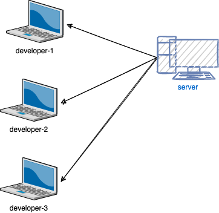
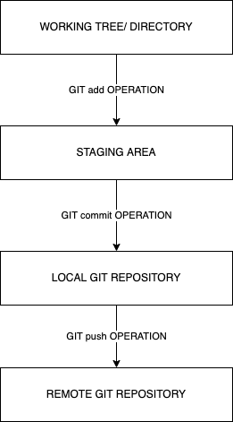

# Git

-   Git is a (distributed) VCS or SCM
-   2005 by Linus Torvalds
-   Set of commands (not the website github.com or gitlab.com or bitbucket.com)
-   Other than git, there is Tortoise SVN, and few other software exist for SCM

## VCS (Version control system)

-   Allows developers to work together
-   Maintains history
-   Developers 'accidentally' may not overwrite others code

Two types of VCS:

1. Centralized VCS (Tortoise SVN)
1. Distributed VCS (Git)

Advantages of Git

1. Time tested
1. Free and open source
1. Small code base and fast
1. Security
1. Provides lots feature like branching, tagging, etc.

What is a git repository?

-   a private workspace
-   maintains a workking copy
-   maintains history

Types of repository

1. Local repository
    - on the user's personal computer/ laptop
    - not accessible to other developers
1. Remote repository
    - on some public (or private) platform
        - like github or gitlab or bitbucket
    - accessible to other people
    - ideally more developers contribute to the development of the code

How to initialize a repository?

1. `git init`
1. `git clone <repository-url>`

### Some commonly used terms:

1. Working directory and Staging area

    - Working directory is just a directory in your computer, initialized with git, supposed to contain files. Git maintains an index of files and directories that are considered as accepted changes. This is called as Index or Staging area.
      

1. Push
1. Pull
1. Commit
1. Branches
    - are used for creating a separate line of development.
    - by default, git creates a branch called "master"
    - usually a new branch is created to wrok on a new feature (for example, login, registration, product list)
    - once the work on the feature branch is completed, we would merge the feature branch with the master branch
1. Tags
1. Clone
1. HEAD
    - is a pointer, which always points to the latest commit in the branch. Whenever you make a commit, HEAD is updated with the last commit id. You can find this information in .git/HEAD and .git/refs/heads

Some of the commands we tried:

1. git init
1. git status
1. git config --list
1. git config --global user.name "Vinod Kumar Kayartaya"
1. git config --global user.email "vinod@vinod.co"
1. git add hello.py
1. git commit -m "created hello.py"
1. git log
1. git diff `old-commit-id` `new-commit-id`
1. git branch
1. git branch feature/login
1. git checkout feature/login
1. git checkout -b feature/registration
1. git merge feature/login
1. git branch --delete feature/login
1. git remote add orgin https://github.com/vinod-kayartaya/ev-nov-2022-example1.git
1. git config --global http.sslVerify false # in case of an error for SSL certificate